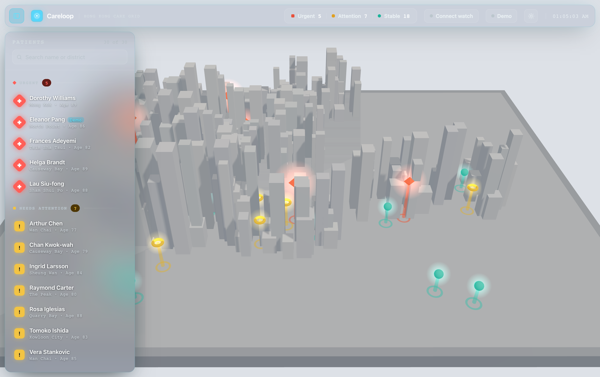
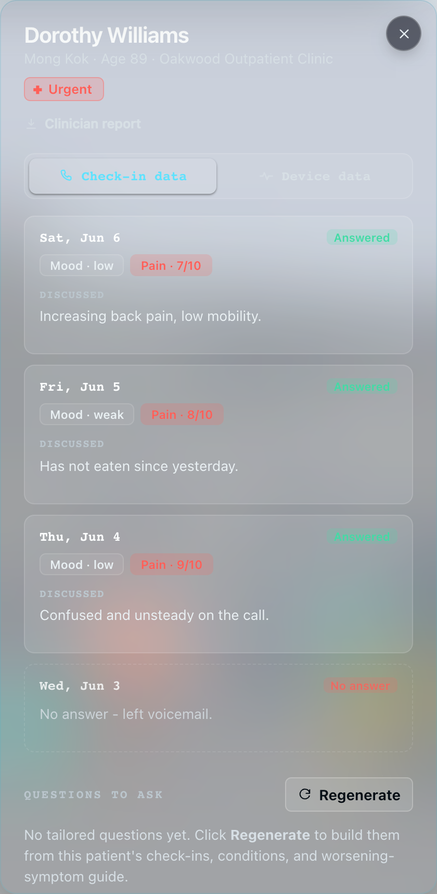
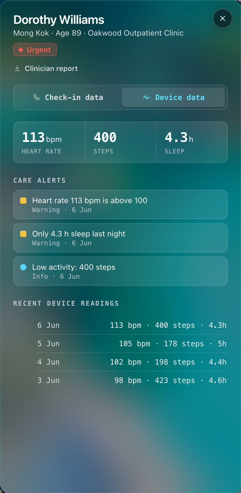

# Elderly Care Platform

> Built for the [EuroTech x Hong Kong Talent Engage Hackathon](https://www.hkengage.gov.hk/en/events/eurotech-x-hkte-hackathon), HealthTech track.

A two-way platform connecting outpatient elderly-care practices with their patients.
Patients receive **daily phone-call check-ins** about their health; combined with
**wearable health data**, this is surfaced to practices as a **health timeline** per
patient.

> A React dashboard and a FastAPI backend, plus a MongoDB store (Docker) holding
> processed FHIR patient records. Real wearable + telephony integrations sit alongside
> synthetic seed data for the roster.
>
> **What's real vs. mocked:** see [`HONESTY.md`](HONESTY.md) - a candid, living map of
> which capabilities work end to end, which are synthetic/seed data, and which are
> vision-doc claims not yet built. Check it before making any external claim.

## Screenshots

| Live care map | Check-in data |
| --- | --- |
|  |  |

| Device data | Patient record (FHIR) |
| --- | --- |
|  |  |

## Hong Kong eHealth context

The target market is the Hong Kong government (healthcare track). The strategic opening:
HK's **eHRSS / eHealth+** system is strong on public-hospital data but **>99% of its
records come from public providers** - the private/outpatient edge and
patient-generated/wearable data barely feed in, a gap the government has publicly named and
is **funding** (eHealth+ Connectivity Support & Accreditation Schemes). HL7 **FHIR is
eHealth's stated direction** ("Advancing from HL7 to FHIR", 2021) but **not yet mandated**,
and eHRSS connection is **gated behind government accreditation** - so no third party can
integrate today.

Our honest position is therefore **"the on-ramp before the highway opens"**: build FHIR
R4-native and accreditation-ready now, integrate when the spec opens. Full market brief,
funding vehicles, policy hooks, and the build roadmap: **[`docs/hk-ehealth-market.md`](docs/hk-ehealth-market.md)**.

## Structure

```
backend/    FastAPI wireframe - patients, check-ins, wearable readings (in-memory mock data)
            backend/scripts/   FHIR preprocessing + MongoDB import scripts
frontend/   React + Vite + TypeScript dashboard
docker/     Dockerfiles for the MongoDB store and the one-shot FHIR importer
data/       data/fhir_processed/ - 555 processed FHIR patient records (JSON)
docs/       Market brief + dashboard screenshots
```

## Running it

The app has **two halves that run at the same time**, so you need **two terminals** -
one for the backend, one for the frontend.

> **Windows / PowerShell note:** PowerShell 5.1 does not support `&&` to chain commands.
> Run each line separately, or use `;`. Commands below are written for PowerShell.

### 1. Backend (FastAPI, port 8000)

```powershell
cd backend
.venv\Scripts\activate
uvicorn app.main:app --reload
```

- API root: http://localhost:8000
- Interactive docs: http://localhost:8000/docs

If `.venv` does **not** exist yet (fresh clone), create it once first:

```powershell
py -3.14 -m venv .venv          # use the `py` launcher, not bare `python`
.venv\Scripts\activate
pip install -r requirements.txt
```

If `.venv\Scripts\activate` errors with "cannot be loaded ... execution policy",
run this once per terminal, then re-run activate:

```powershell
Set-ExecutionPolicy -Scope Process -Bypass
```

### 2. Frontend (React + Vite, port 5173)

Open a **second** terminal:

```powershell
cd frontend
npm run dev
```

If `node_modules` does not exist yet (fresh clone), run `npm install` once first.

Open http://localhost:5173. The dashboard expects the backend on port 8000 (override
with `VITE_API_URL` - see `frontend/.env.example`).

### Common gotchas

- **`The token '&&' is not a valid statement separator`** - you're on PowerShell 5.1;
  run the commands on separate lines instead of joining with `&&`.
- **`Unable to copy ...venvlauncher.exe to ...python.exe`** - the `.venv` already exists
  and was locked (a running server, editor, or antivirus). Don't recreate it; just
  activate it. To rebuild from scratch, close everything using it, then
  `Remove-Item -Recurse -Force .venv` and recreate.
- **Bare `python` opens the Microsoft Store** - the `python` command can resolve to a
  Store stub. Prefer the `py` launcher (`py -3.14 ...`) for venv creation.

## Patient data store (MongoDB)

Processed **FHIR patient records** live in MongoDB, run via Docker Compose. A single
`docker compose up` starts the database **and** loads the records - no manual import step.

> **Fresh clone / new machine:** the uncompressed records are gitignored; the repo ships
> them as `data/fhir_processed.tar.gz`. Extract it in place **before** the first
> `docker compose up`, or the importer exits with "no valid records loaded":
>
> ```bash
> tar -xzf data/fhir_processed.tar.gz -C data    # -> data/fhir_processed/*.json (555 records)
> ```
>
> (No `mkdir` needed - `data/` already exists from the clone.) To repack after changing
> records: `tar -czf data/fhir_processed.tar.gz -C data fhir_processed`.

```bash
docker compose up -d --wait     # start Mongo + auto-import, block until ready
docker compose down             # stop (data kept in the named volume)
docker compose down -v          # stop AND wipe the database
```

Two services in `docker-compose.yml`:

- **`mongo`** - `mongo:7` (built from `docker/mongo/Dockerfile`), published on
  `localhost:27017`, with a healthcheck. Data persists in the named volume
  `careloop-mongo-data`, so records survive restarts.
- **`importer`** - a one-shot job (`docker/importer/Dockerfile`) that waits for Mongo's
  healthcheck, then runs `backend/scripts/import_fhir_to_mongo.py` and exits. It upserts
  by `_id`, so it's idempotent and re-runs harmlessly on every `up`.

Layout: database **`careloop`**, collection **`fhir_patients`**, **555** records keyed by
`_id` (the patient UUID). Source JSON is bind-mounted read-only from `data/fhir_processed/`,
so adding records there and re-running `up` picks them up without a rebuild.

**Query a patient by id** (the `_id` is the patient UUID, so this is a primary-key hit):

```bash
# from the host, via the container's mongosh
docker exec careloop-mongo mongosh careloop --quiet --eval \
  'JSON.stringify(db.fhir_patients.findOne({_id: "<patient-uuid>"}), null, 2)'

# list some ids to try
docker exec careloop-mongo mongosh careloop --quiet --eval \
  'db.fhir_patients.find({}, {_id:1}).limit(10).forEach(d => print(d._id))'
```

From Python (`pip install pymongo`, already in `backend/requirements.txt`):

```python
from pymongo import MongoClient
col = MongoClient("mongodb://localhost:27017").careloop.fhir_patients
patient = col.find_one({"_id": "<patient-uuid>"})
```

To re-import manually (e.g. after regenerating records) without Compose:

```bash
cd backend
python -m scripts.import_fhir_to_mongo          # all defaults: careloop.fhir_patients
python scripts/import_fhir_to_mongo.py --drop   # clean reload
```

### Surfacing real patients on the dashboard

The dashboard roster is mostly seeded mock patients, but you can promote specific
records to **real data** by listing their MongoDB `_id`s in **`featured_patients.md`**
(repo root):

```markdown
- 0ae08855-8e6c-5308-3ab5-da0080b36425
- 01d78eb5-7f50-45e9-f524-921196a3dffe
```

On startup the backend (`app/fhir_source.py`) reads that file, queries Mongo for those
ids, and binds each - top to bottom - to a dashboard patient slot: the first id becomes
patient 1, the second patient 2, and so on (skipping the live Garmin patient). Those
slots show the **real name, age, and a medical profile** (chronic conditions, active
medications, allergies) pulled from FHIR; every other patient stays mock. The detail
panel marks them with a "Real record · FHIR" tag and a Medical profile section, served by
`GET /patients/{id}/profile`.

This is **best-effort**: if Mongo is down, the file is empty, or an id isn't found, that
slot just stays mock - the dashboard never breaks. The file is read **at startup**, so
restart the backend after editing it. Override its location with `FEATURED_PATIENTS_FILE`.

## API endpoints

| Method | Path                              | Description                     |
| ------ | --------------------------------- | ------------------------------- |
| GET    | `/health`                         | Liveness check                  |
| GET    | `/patients`                       | List all patients with status   |
| GET    | `/patients/{id}`                  | Single patient detail           |
| GET    | `/patients/{id}/profile`          | Real FHIR medical profile (MongoDB-backed patients; 404 if mock) |
| GET    | `/patients/{id}/checkins`         | Daily check-in history          |
| GET    | `/patients/{id}/wearables`        | Wearable readings (daily)       |
| GET    | `/patients/{id}/vitals`           | Rich Garmin vitals (stress, SpO2, etc.) |
| POST   | `/patients/{id}/calls/trigger`    | Place an instant check-in call  |
| POST   | `/patients/{id}/calls/screening`  | Place a cognitive-screening call (3-word recall + orientation) |
| POST   | `/patients/{id}/calls/emergency`  | Wearable-triggered emergency call (patient → nurse fallback) |
| GET    | `/patients/{id}/calls`            | Call history                    |
| GET    | `/patients/{id}/calls/{cid}/conversation` | Transcript + extracted check-in data for a call |
| GET    | `/patients/{id}/calls/{cid}/audio` | Download the call recording (mp3) |
| GET/PUT| `/patients/{id}/calls/config`     | Read/update the questions asked  |
| GET/POST| `/patients/{id}/questions`       | Get / regenerate tailored questions (Gemma) |
| POST   | `/patients/{id}/calls/schedules`  | Schedule a call (one-off/daily) |
| GET    | `/patients/{id}/calls/schedules`  | List upcoming schedules         |
| DELETE | `/patients/{id}/calls/schedules/{sid}` | Cancel a schedule          |
| GET    | `/patients/{id}/summary`          | Vitals summary statistics       |
| GET    | `/patients/{id}/live`             | Current live vitals + escalation status |

## Real Garmin wearable data (patient 5)

Patient id 5 ("Dario Monopoli - live Garmin") is backed by real data pulled from a Garmin
account, not mock seed data. It shows the wearable pipeline working end to end. The four
elderly patients above stay mock.

How it fits together:

- Extraction: `backend/garmin_pipeline/` pulls vitals from Garmin (heart rate, resting HR,
  stress, sleep, SpO2, respiration, body battery, steps) and exports them as sample dicts.
  Needs `pip install garminconnect curl_cffi` and the account owner's own login.
- Serving: `app/wearable_source.py` aggregates those sample dicts per day into the existing
  `WearableReading` model, so `GET /patients/5/wearables` returns real daily vitals with no
  frontend change. The richer per-reading data is at `GET /patients/5/vitals?kind=<kind>`
  (e.g. `stress`, `spo2`, `sleep_stage`), in the same sample-dict shape used for FHIR mapping.
- Data source: it reads `$GARMIN_SAMPLES` if set, otherwise `backend/data/garmin_samples.json`
  (the real export, gitignored so the data stays local), otherwise
  `backend/app/sample_data/garmin_fallback.json` (a committed synthetic file, source
  "synthetic", so a fresh clone still has data to show).

Refresh the real data (on the machine with the Garmin login):

```bash
cd backend
python -m garmin_pipeline.cli login            # once; enter the emailed code if asked
python -m garmin_pipeline.cli backfill --days 30
python -m garmin_pipeline.cli export --out data/garmin_samples.json
# restart the backend to pick it up
```

Blood pressure is not included: Garmin watches have no blood-pressure sensor.

## Outbound check-in calls (ElevenLabs + Twilio)

Practices can trigger an **AI voice check-in call** to a patient - instantly ("Call now"),
once at a chosen time, or repeating daily. Each call carries the patient's recent context
(last few check-ins + latest wearable reading) and the practice's configured questions.
Calls are placed via the ElevenLabs Twilio integration on the **EU data-residency**
endpoint (`POST https://api.eu.residency.elevenlabs.io/v1/convai/twilio/outbound-call`).

**Setup:**

1. Copy `backend/.env.example` to `backend/.env` and fill in:
   `ELEVENLABS_API_KEY`, `ELEVENLABS_AGENT_ID`, `ELEVENLABS_AGENT_PHONE_NUMBER_ID`
   (and optionally `TWILIO_API_KEY`).
2. Context is injected as ElevenLabs **dynamic variables**, so the agent's prompt in the
   ElevenLabs dashboard **must reference** these placeholders, or calls go out context-less:
   `{{patient_name}}`, `{{patient_age}}`, `{{recent_summary}}`, `{{questions}}`.
3. To demo, set a patient's "To number" (in the dashboard's call panel) to your own phone.

Schedules and call history are in-memory and reset when the backend restarts.

## Tests

```bash
cd backend
.venv\Scripts\activate
pip install pytest httpx
pytest
```

## Not yet built (planned)

Practices entity, authentication, a real database, write endpoints, and real
telephony / wearable-device integrations. The FHIR/eHRSS integration, PDPO/encryption,
and Cantonese-AI claims from `PROJECT.md` are **roadmap, not current capability** - see
[`HONESTY.md`](HONESTY.md) for the full real-vs-mocked breakdown and
[`docs/hk-ehealth-market.md`](docs/hk-ehealth-market.md) for the eHRSS engagement plan.
